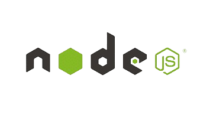
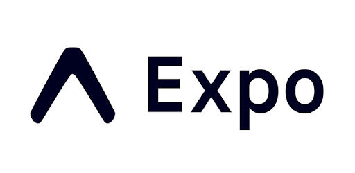

<h1 align="center">Hey Developers 👋</h1>

<h1 align="center" font="bold">Sumit Jagtap, Software Engineer 🚀</h1>

### 💫 About Me:
🌟 Sumit Jagtap here, a Software Engineer with a zest for innovation and a hunger for learning. 

💡 Across diverse tech domains, I thrive on tackling challenges and embracing new opportunities. 

🚀 Join me on this thrilling journey of exploration and development in the tech realm! 

### 🌐 Socials:
 
 

### 💻 Tech Stack

